# 👋 Olá, eu sou o Lucas Silva

**Líder técnico & Desenvolvedor Full-Stack** · Python · TypeScript · Node.js

Coordeno times e construo sistemas em produção — do modelo de dados ao deploy.

---

## 🎯 O que eu faço hoje

Lidero a engenharia de um portfólio de produtos na **SEC365**: coordeno desenvolvedores
distribuídos entre frentes paralelas, quebro escopo em trabalho executável, reviso entrega —
e continuo escrevendo código todo dia.

**Escala atual:** 13 projetos ativos em duas operações · times somando 17 pessoas

| Frente | O que envolve |
| --- | --- |
| **Arquitetura & backend** | Serviços em Python/FastAPI, filas e workers assíncronos, modelagem de dados e migrations, APIs que precisam sustentar carga real |
| **Plataformas web** | Painéis operacionais em React + TypeScript: tabelas grandes, dado em tempo real, fluxo de quem usa o sistema o dia inteiro |
| **Sistemas com IA** | Agentes e pipelines com LLM em produção — orquestração, avaliação da saída e custo por execução |
| **Automação & coleta** | Playwright, scraping resiliente e OCR: processo manual que vira pipeline sem intervenção |
| **Infra & entrega** | Docker Compose multi-serviço, deploy em VPS e edge, CI/CD, observabilidade |
| **Coordenação técnica** | Distribuir por capacidade, revisar entrega, desbloquear quem travou e manter o prazo de pé |

> Os produtos são desenvolvidos sob contrato e não são públicos. O que dá para mostrar
> aqui é a natureza do trabalho — o código fica com o cliente.

---

## 🧠 Como eu trabalho

**Meço antes de otimizar.** Diagnóstico sai de log, perfil e número medido — não de palpite.
Hipótese refutada por medição vale mais que opinião bem argumentada.

**Entrego ponta a ponta.** Modelo de dados, API, interface e deploy. Sem jogar por cima do muro.

**Se roda duas vezes igual, vira script.** Automação não é enfeite: é o que devolve o dia de
alguém.

---

## 🧰 Stack

**Linguagens**

**Backend & Dados**

**Frontend**

**Automação & Infra**

---

## 📊 GitHub em números

<picture>
  <source media="(prefers-color-scheme: dark)" srcset="https://github-profile-summary-cards.vercel.app/api/cards/profile-details?username=OQAY&theme=github_dark">
  
</picture>

<picture><source media="(prefers-color-scheme: dark)" srcset="https://github-profile-summary-cards.vercel.app/api/cards/most-commit-language?username=OQAY&theme=github_dark"></picture> <picture><source media="(prefers-color-scheme: dark)" srcset="https://github-profile-summary-cards.vercel.app/api/cards/productive-time?username=OQAY&utcOffset=-3&theme=github_dark"></picture>

---

## 📫 Onde me encontrar

- 🌐 Portfólio — [portfolio-oqay.vercel.app](https://portfolio-oqay.vercel.app)
- 💼 LinkedIn — [lucas-silva-7408842b5](https://www.linkedin.com/in/lucas-silva-7408842b5/)
- 🐙 GitHub — [@OQAY](https://github.com/OQAY)

---

<picture>
  <source media="(prefers-color-scheme: dark)" srcset="dist/pacman-contribution-graph-dark.svg">
  <source media="(prefers-color-scheme: light)" srcset="dist/pacman-contribution-graph.svg">
  
</picture>

